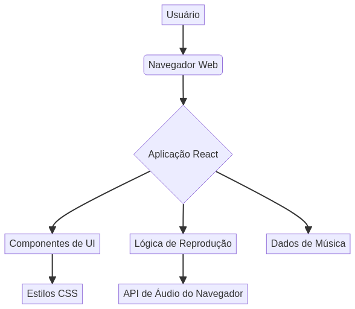

# React-Music-Player

[](https://opensource.org/licenses/MIT)
[](https://react.dev/)
[](https://developer.mozilla.org/en-US/docs/Web/JavaScript)


## English

### Modern Music Player Interface

This project features a modern and responsive music player interface built with React. It aims to provide a seamless and engaging user experience for playing music.

### Features

*   Intuitive User Interface
*   Responsive Design
*   Basic Playback Controls (Play, Pause, Next, Previous)

### Technologies Used

*   React
*   JavaScript
*   HTML5
*   CSS3

### Architecture Diagram



### Quick Start

To get this project up and running on your local machine, follow these steps:

1.  **Clone the repository:**

    ```bash
    git clone https://github.com/galafis/React-Music-Player.git
    cd React-Music-Player
    ```

2.  **Install dependencies:**

    ```bash
    npm install
    ```

3.  **Start the development server:**

    ```bash
    npm start
    ```

    This will open the application in your browser at `http://localhost:3000`.

### Author

Gabriel Demetrios Lafis

### License

This project is licensed under the MIT License - see the [LICENSE](LICENSE) file for details.

## Português

### Interface Moderna de Reprodutor de Música

Este projeto apresenta uma interface moderna e responsiva de reprodutor de música construída com React. O objetivo é proporcionar uma experiência de usuário fluida e envolvente para a reprodução de música.

### Funcionalidades

*   Interface de Usuário Intuitiva
*   Design Responsivo
*   Controles Básicos de Reprodução (Reproduzir, Pausar, Próxima, Anterior)

### Tecnologias Utilizadas

*   React
*   JavaScript
*   HTML5
*   CSS3

### Diagrama de Arquitetura


### Início Rápido

Para colocar este projeto em funcionamento em sua máquina local, siga estes passos:

1.  **Clone o repositório:**

    ```bash
    git clone https://github.com/galafis/React-Music-Player.git
    cd React-Music-Player
    ```

2.  **Instale as dependências:**

    ```bash
    npm install
    ```

3.  **Inicie o servidor de desenvolvimento:**

    ```bash
    npm start
    ```

    Isso abrirá o aplicativo em seu navegador em `http://localhost:3000`.

### Autor

Gabriel Demetrios Lafis

### Licença

Este projeto está licenciado sob a Licença MIT - veja o arquivo [LICENSE](LICENSE) para detalhes.

